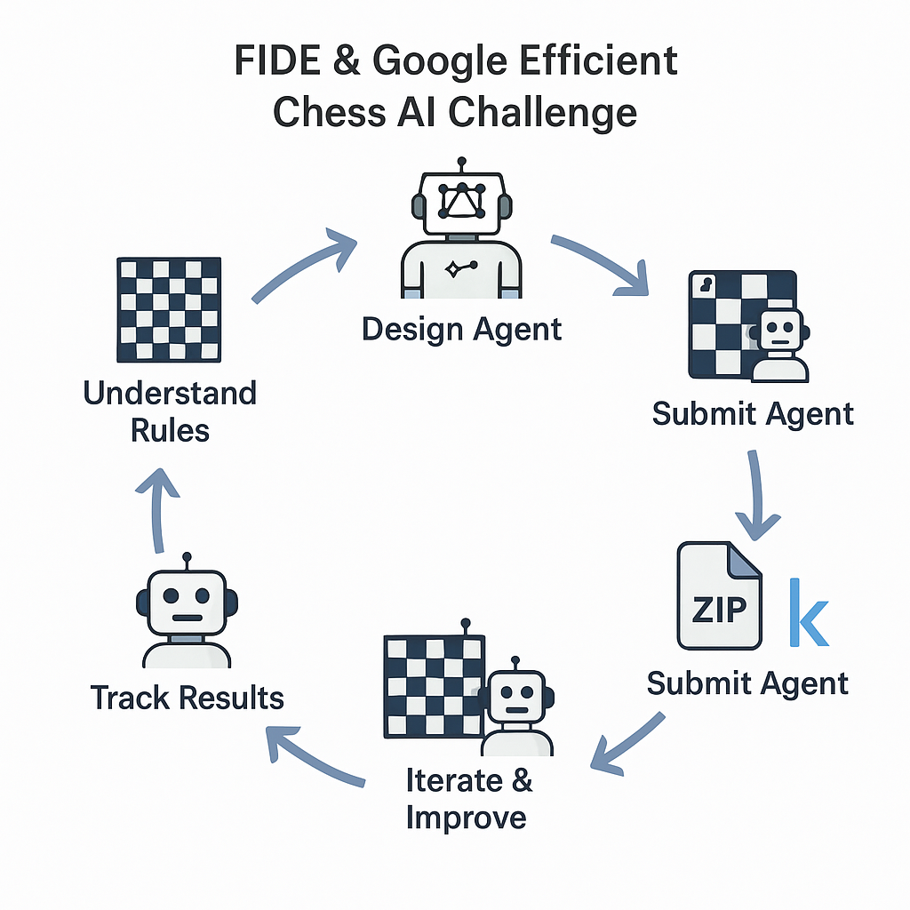

# FIDE-Google-Efficient-Chess-AI-Challenge



## 🧠 AI Agents Workflow

## Overview
The **FIDE-Google Efficient Chess AI Challenge** is a Kaggle competition that focuses on developing **resource-efficient chess-playing AI agents**. Unlike traditional chess engines that rely on vast computational power, this challenge emphasizes **efficiency and ingenuity** over brute-force computing.

## Competition Details
- Hosted on **Kaggle**: [Competition Page](https://www.kaggle.com/competitions/fide-google-efficiency-chess-ai-challenge)
- Organized by **FIDE & Google**.
- Prize Pool: **$50,000**.
- Submission Deadline: **February 11, 2025**.
- Participants must create **chess-playing AI agents** that operate under strict computational constraints.

## Constraints
The AI agent must adhere to the following limitations:
- **Memory Usage**: ≤ **5 MiB RAM**.
- **CPU Usage**: Single **2.20GHz core**.
- **Submission Size**: ≤ **64KiB (compressed)**.
- **Time Control**: **10s per move** with **0.1s simple delay**.

## Features of a Competitive AI Agent
- **Minimax Search** with **Alpha-Beta Pruning**.
- **Iterative Deepening** for optimized move selection.
- **Basic Evaluation Function**:
  - Material balance.
  - Piece-square tables.
  - Mobility evaluation.
- **Time Management**: Conservative time usage with early stopping.

## Getting Started
### **1. Clone the Repository**
```bash
git clone https://github.com/ohmyilya/FIDE-Google-Efficient-Chess-AI-Challenge.git
cd FIDE-Google-Efficient-Chess-AI-Challenge


2. Install Dependencies
pip install -r requirements.txt


3. Run the Chess Agent
python main.py


Submission Guidelines
- Participants can submit up to five AI agents per day.
- Each submission competes against other bots on the leaderboard.
- Skill ratings adjust based on wins, losses, and ties.
- Older submissions are deactivated once a team reaches two active submissions.

